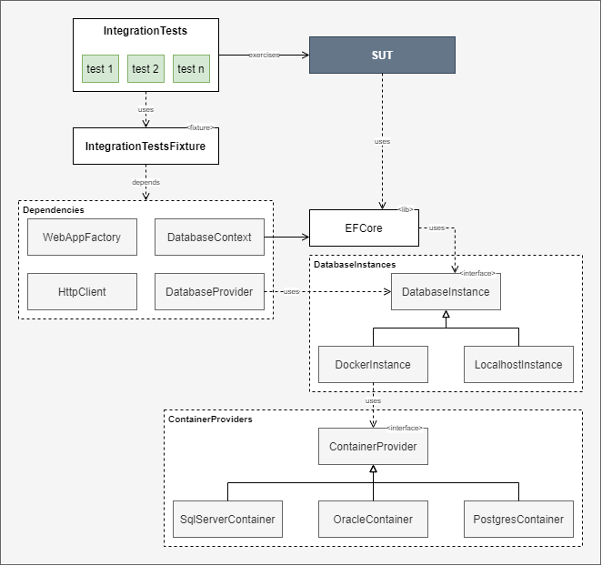

# Descrição
Exemplo de uma suite de testes de integraçao com banco de dados utilizando Docker.

# Dependências Utilizadas
- [Bogus](https://github.com/bchavez/Bogus)
- [FluentAssertions](https://github.com/fluentassertions/fluentassertions)
- [Microsoft.AspNetCore.Mvc.Testing](https://www.nuget.org/packages/Microsoft.AspNetCore.Mvc.Testing)
- [xunit](https://xunit.net/)

# Diagrama de Classes

## SUT
System Under Test, é a parte do nosso sistema que será testado, neste exemplo é uma API de CRUD.

## IntegrationTests
Classe responsável por implementar os cenários de testes, bem como os **Helper Methods** utilizados para simplificar o **Setup** e **Teardown** dos **Fixtures**.

## IntegrationTestsFixture
Classe compartilhada por todas as suítes de testes de integração, ela fornece acesso a quatro recursos compartilhados pelos testes :
  - **WebAppFactory** : Responsável por criar um WebHost e publicar nossa aplicação SUT.
  - **HttpClient** : Instância httpclient conectada ao WebHost, utilizada para fazer os requests de teste.
  - **DatabaseContext** : Responsável por prover acesso direto ao banco de dados nas fases de setup e teardown.
  - **DatabaseProvider** : Responsável por criar instancias de banco de dados, seja localhost ou através de um container docker.

## DatabaseInstances
Módulo responsável por implementar recursos de acesso a instancia do banco de dados.
  - **IDatabaseInstance** : Interface que define métodos de acesso a instancias de banco de dados. 
  - **DockerInstance** : Implementação concreta da interface *IDatabaseInstance*, cria instancias de banco de dados utilizando docker containers.
  - **LocalhostInstance** : Implementação concreta da interface *IDatabaseInstance*, prove acesso a instancias de banco de dados que estejam rodando localmente (localhost).
  
## ContainerProviders
Módulo responsável por implementar todas as configurações necessárias para cada container de banco de dados.
  - **IContainerProvider** : Interface que define métodos de acesso as configurações dos containers.
  - **SqlServerContainer** : Implementação concreta da interface *IContainerProvider*, prove configurações para um container de banco de dados SQL SERVER.
  - **OracleContainer** : Implementação concreta da interface *IContainerProvider*, prove configurações para um container de banco de dados ORACLE.
  - **PostgresContainer** : Implementação concreta da interface *IContainerProvider*, prove configurações para um container de banco de dados POSTGRES.
